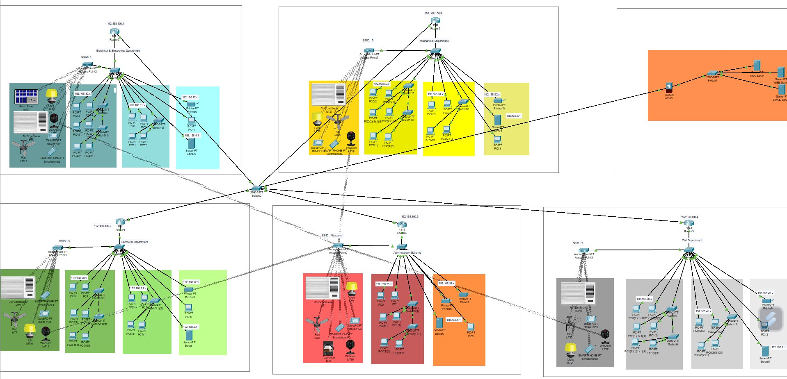

# Smart-University-Network-Packet-Tracer
A Cisco Packet Tracer simulation of a Smart University with departmental segmentation, IoT, and ACL security.
# Smart University: A Cisco Packet Tracer Project

This project is a comprehensive network simulation of a modern, "smart" university campus built in Cisco Packet Tracer. It demonstrates a hierarchical network design, departmental segmentation, secure access control, and IoT integration for smart building automation.

## Network Diagram

## Key Features

* **Hierarchical Network Design:** A multi-router, multi-switch topology connecting five major university departments.
* **Departmental Segmentation:** Each department operates on its own subnet for improved traffic management and security.
  *Administration Building
             **Main Router: `192.168.100.3`
             **Main server: `192.168.1.1`
             **Teachers’ IP: `192.168.30.0/24`
             **Printers’ IP: `192.168.31.0/24`
             **Access point’s SSID: `Nirupama`
  *Electrical and Electronic Department
             **Main Router: `192.168.100.1`
             **Main server: `192.168.4.1`
             **Students' IP: `192.168.10.0/24`
             **Teachers’ IP: `192.168.11.0/24`
             **Printers’ IP: `192.168.12.0/24`
             **Access point’s SSID: `4`
  *Computer Department
             **Main Router: `192.168.100.2`
             **Main server: `192.168.3.1`
             **Students' IP: `192.168.20.0/24`
             **Teachers’ IP: `192.168.21.0/24`
             **Printers’ IP: `192.168.22.0/24`
             **Access point’s SSID: `3`
  *Mechanical Department
             **Main Router: `192.168.100.5`
             **Main server: `192.168.5.1`
             **Students' IP: `192.168.50.0/24`
             **Teachers’ IP: `192.168.51.0/24`
             **Printers’ IP: `192.168.52.0/24`
             **Access point’s SSID: `5`
  *Civil Department
             **Main Router: `192.168.100.4`
             **Main server: `192.168.2.1`
             **Students' IP: `192.168.40.0/24`
             **Teachers’ IP: `192.168.41.0/24`
             **Printers’ IP: `192.168.42.0/24`
             **Access point’s SSID: `2`
    
* **Core Services:** A separate simulated DMZ/Cloud provides essential services to the entire campus (DNS, Web, and Email).
* **Wireless & Wired Access:** Each department is equipped with both wireless Access Points (for laptops, tablets) and switches (for PCs, printers).

## "Smart" IoT Integration

This simulation includes a full suite of IoT devices in each department, all connected via Home Gateways and MCUs to create a smart, automated campus environment.
* **Environmental Control:** Smart Fans, Air Conditioners, and Smart Windows
* **Energy Management:** Solar Panels and Power Meters
* **Security & Safety:** Webcams, Motion Detectors, and Fire Sprinklers
* **Automation:** Smart Lights and Smart Doors

## Security & Access Policies

A key feature of this network is the implementation of **Access Control Lists (ACLs)** on the core routers to enforce specific business and security rules.

* **PERMITTED:**
    * Any student in any department can communicate with each other.
    * Any student in any department can communicate with any teacher in any department.

* **DENIED:**
    * **All** student devices are **explicitly blocked** from accessing **any** network printer. This secures resources and prevents unauthorized printing.

## How to Use

To explore this project:
1.  Download and install [Cisco Packet Tracer](https://www.netacad.com/courses/packet-tracer) (Version 8.x or newer is recommended).
2.  Download the `.pkt` file from this repository.
3.  Open the `.pkt` file with Packet Tracer.
